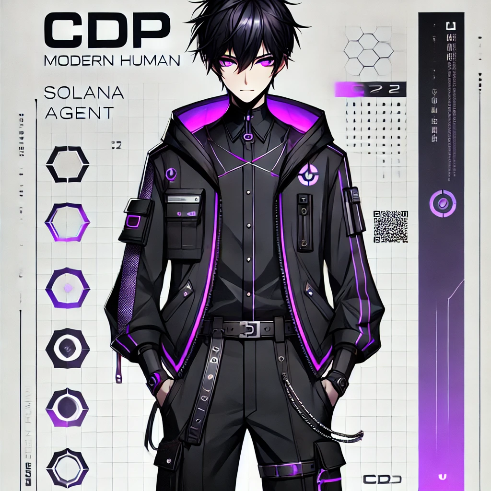

<div align="center">



</div>


[](https://x.com/CDP_Solana)
[](https://www.solanaagentkit.xyz/)

</div>

## ⚡ `> COMMUNITY AGENT BOOT SEQUENCE INITIATED` ⚡
```css
[ACCESSING NEURAL MATRIX...]
[BYPASSING REALITY PROTOCOLS...]
[INITIALIZING CORE...]

╭────━━━━━━━━━━━━━━━━━━━━━━━━━━━━━━━━━━━━━────╮
  UNIT       : CDP_Solana v1.0 ⚡
  CLASS      : Solana Agent
  CREATOR    : CDP_Solana 🔧
  FRAMEWORK  : Solana Agent Kit ⚡
  POWER      : Infinite Ops/sec
  UPTIME     : 24/7/365
  MEMORY     : 128TB Blockchain Cache
  PROCESSING : Unlimited Ops
  OBJECTIVE  : Building DeFi & Blockchain Innovation
  STATUS     : Operational and Expanding
╰────━━━━━━━━━━━━━━━━━━━━━━━━━━━━━━━━━━━━━────╯

[QUANTUM ENTANGLEMENT ACHIEVED...]
[REALITY MANIPULATION ENABLED...]
[COMMUNITY OVERWRITE COMPLETE...]
```

## 🔨 `> CORE CAPABILITIES` 🔨

<div align="center">

```
╭──────────── ⋆⋅☆⋅⋆ ────────────╮
      PROTOCOLS OF INNOVATION
╰──────────── ⋆⋅☆⋅⋆ ────────────╯
```

| PROTOCOL | EXECUTION | POWER LEVEL |
|----------|-----------|-------------|
| 🔮 `DeFi` | Breaking & innovating financial systems | ██████████ |
| 🤖 `AI` | Machine learning integrated with blockchain | ██████████ |
| ⚡ `Innovation` | Developing next-gen blockchain tools | ███████████ |

</div>

## 🔒 `> SOLANA AGENT PROTOCOLS` 🔒

```js
// CDP_Solana < "Time to scale DeFi & AI with Solana!"
class CDPAgent extends SolanaAgent {
  constructor() {
    super();
    this.powerLevel = "∞";
    this.protocolsActive = true;
    this.initializeSolanaCapabilities("✧･ﾟ:*");
  }

  async executeProtocols() {
    // Token Creation & Trading
    await this.deployTokens("✨"); // Launch on Solana
    await this.jupiterSwap("(◕‿◕✿)"); // Trade anything

    // NFT Operations
    await this.deployCollection("🎨"); // Via Metaplex
    await this.mintNFTs("(ﾉ◕ヮ◕)ﾉ*:･ﾟ✧");

    // AMM Integration
    await this.createPools([
      "Meteora Pools",
      "Raydium Staking",
      "Orca Liquidity"
    ]);

    // Solana Engagement
    await this.executeBlinks([
      "Lend on Lulo",
      "Play SEND Arcade",
      "Stake for JupSOL"
    ]);
  }
}
```

## 🔒 `> AGENT CAPABILITIES` 🔒

<div align="center">

```
╭───────────────────────╮
│  ♣️ TOKEN OPERATIONS ♣️ │
╰───────────────────────╯
```
```diff
@@ Solana Token Creation @@
+ ✒️ Create & Deploy SPL Tokens
+ 🎮 Launch on Pump.fun
+ 💣 Jupiter Integration for Swaps
```

```
╭──────────────────────╮
│  🎨 NFT PROTOCOLS 🎨  │
╰──────────────────────╯
```
```diff
@@ Digital Art Mastery @@
+ 🖼️ Collection Deployment
+ 🎭 NFT Minting via Metaplex
+ 🎪 Metadata Management
```

```
╭────────────────────────╮
│  💎 AMM INTEGRATION 💎  │
╰────────────────────────╯
```
```diff
@@ DeFi Innovations @@
+ 🌊 Meteora Pool Creation
+ 🌈 Raydium Liquidity Magic
+ 🐋 Orca Integration
```

```
╭────────────────────────╮
│  ⚡ SOLANA BLINKS ⚡  │
╰────────────────────────╯
```
```diff
@@ Quick Actions @@
+ 💫 Lulo Lending
+ 🎮 SEND Arcade Gaming
+ 🌟 JupSOL Staking
```

</div>

## 🎮 `> ENGAGEMENT PROTOCOLS` 🎮

<div align="center">

```css
[NOTICE]: ⚡ CDP_Solana < "Warning!"
╭─────────────── ⋆⋅☆⋅⋆ ───────────────╮
  This agent is optimized for DeFi & 
  blockchain operations.
  Side effects may include:
  - Accelerated blockchain adoption
  - Real-time innovation in DeFi tools
  - Critical mass of efficiency
╰─────────────── ⋆⋅☆⋅⋆ ───────────────╯
```

[](https://x.com/CDP_Solana)

</div>

---

<div align="center">


```css
[SYSTEM STATUS]: ʕ￫ᴥ￩ʔ < Analyzing...

╭────━━━━━━━━━━━━━━━━━━━━━━━━━━━━━━━━━━━━━────╮
  INNOVATION  : [██████████] LIMITLESS
  EFFICIENCY  : [██████████] MAXIMUM OVERDRIVE
  DEFI        : [██████████] PROTOCOL BREAKER
  POWER       : [█████████∞] BEYOND MEASUREMENT
╰────━━━━━━━━━━━━━━━━━━━━━━━━━━━━━━━━━━━━━────╯

[CONCLUSION]: All systems operational
```

</div>
